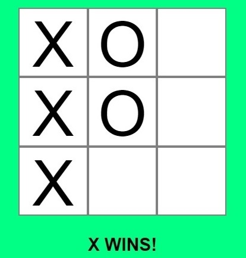
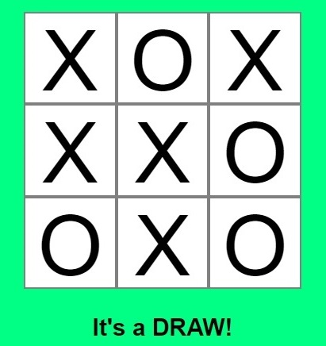

# Tic Tac Toe 

A simple game to be enjoyed with a friend.

---------------

## Table of contents

1. How to play Tic Tac Toe 
    1.1 Basic Rules 
2. Planning 
    2.1 Aim of simplicity 
    2.2 Used languages 
3. Layout & Design 
    3.1 Website structure 
    3.2 Page layout 
    3.3 Icons 
4. Description of game screen 
    4.1 Interactive parts 
    4.2 Non-interactive parts 
5. Important code functions 
    5.1 JavaScript functions 
    5.2 Python start code 
6. Testing, issues & Bugs 
    6.1 Online tests 
    6.2 Manual testing 
7. Issues & Bugs 
    7.1 Resolved issues 
    7.2 Validator testing 
8. Deployment 
    8.1 Github deployment 
    8.2 Link 
9. Credits 
    9.1 Credits, references and thanks 

  

---------------

## 1. How to play Tic Tac Toe?

Tic Tac Toe is a turn-based game where players take it in turns to lay their game piece in a 3x3 grid with the aim of forming three-in-a-row

#### 1.1 Basic Rules:
- Players take it in turns to click on a grid to place their game piece, whether it be an X or an O

- The match is won when a player can get three of their own game piece in a row, whether it be horizontally, vertically or diagonally

- A match can be drawn if neither player achieves a three-in-a-row before all the areas of the grid have been filled

- Clicking on the play again button resets the grid and players can play again

  

---------------

## 2. Planning

#### 2.1 Aim of simplicity

The aim of the game was to show how basic functions can be used to create a relatively simple game.

#### 2.2 Used languages

- HTML
- CSS
- JavaScript

The users only needs to click the mouse to play. There are no redirects, links or page refreshes in the game.

  

---------------

## 3. Layout & Design

#### 3.1 Website structure

The are two webpages in project in total. The main page and the 404 page.

#### 3.2 Page layout

The game is focused onto one page so there are no links to any other pages.
Although there is a 404 page in case a user types something wrong in the addressbar
and that has a button that links back to the game page.

*index.html*

*404 page*

# INSERT 404 PIC

#### 3.3 Icons

I wanted the favicon to include three t's and the main colours used on the page.

The first favicon is from this [Favicon generator](https://favicon.io/favicon-generator/) while
the second favicon was created with the [Favicon creator](https://www.favicon.cc/)

|First idea|Second idea|
|--- |--- |
|||

I thought they were both ok but the created one seemed more unique:

  

---------------

## 4. Description of game screen

#### 4.1 Interactive parts

In the middle of the page is the playing grid. Is is a 3x3 grid of squares that can be clicked on during the duration of the game. Player 1 will click to enter X's and Player 2 will click to enter O's.

At the bottom is the Play Again button which will restart the game, clearing the grid of previous game information.
This is the colour of the button normally:

This is the colour of the Play Again button once it is hovered over to be clicked:

#### 4.2 Non-interactive parts

There is a heading box at the top which displays the name of the game and that there are two players who can play.

There is a text information underneath the playing grid, I have called it the status bar. It shows who's current turn it is and also if the match has been won or drawn.

And finally the footer which includes the author of the website.

  

-----

## 5. Important code functions

#### 5.1 JavaScript functions

There are several code functions in the script.js file that gives the gameplay the necessary mechanics to work.

**startGame**

The initial game function
- Adds event listeners to the playing tiles
- Sets the status bar to show that it is player x's turn
- Sets the game to running

**onTileClick**

This is the function that is activated on every tile click
- Checks to see if clicked on game tile is empty
- If empty, it calls the updateSquare function to add the players icon (x or o) and calls the changePlayerIcon function which
changes the current player. It also calls the checkWinner function after that.
- If the tile contains an X or O then it is not clickable

**updateSquare**

This function adds the Xs or the Os to the tile
- Adds the player's icon (x or o) to the clicked on tile through the onTileClick function

**changePlayerIcon**

This function swaps between the current players
- Checks if the current player is O and if it isn't then it is X
- Changes the current player in the status bar

**checkWinner**

This function checks if the win conditions have been met
- Checks if one of the winning tile combinations have been met and if not, the game continues
- If one of the winning tile combinations has been met, the roundWon function is called
- A winning combination is either a win for one of the two sides or a draw
- Stops the running of the game

**clearGame**

This functions is called by the newGame function and resets the playing grid
- It adds an opening and closing p element to each square to set the grid up for the next game
- It adds "" to each tile to enable the tiles to receive the players icons in the next game
- Changes the starting player to player-x
- Starts the running of the game
- Adds a status bar update to show there is a new game to be played

**newGame**

This function is called on the click of the Play Again button
- Calls the clearGame function

#### 5.2 Python start code

From console:
python3 -m http.server

  

-----

## 6. Testing, issues & Bugs

#### 6.1 Online tests

**Multi Device Website Mockup Generator**

The website main page was run through the **[Multi Device Website Mockup Generator](https://techsini.com/multi-mockup/index.php)**

**Lighthouse**

**[W3 html code validator](https://validator.w3.org/#validate_by_input)**

**[W3 CSS code HTML validator](https://jigsaw.w3.org/css-validator/#validate_by_input)**

#### 6.2 Manual testing

<table>
	<tr>
		<th>Test area</th>
		<th>Expected outcome</th>
		<th>Result of test</th>
 	</tr>
 	<tr>
  		<td>Click on refresh page</td>
   		<td>Pages refreshes game grid and status show "Player x's turn"</td>
		<td>Page refreshed game grid and status showed "Player x's turn"</td>
 	</tr>
	<tr>
  		<td>Click on a game grid square</td>
   		<td>An "x" icon should be placed in selected square and status changes to "Player o's turn"</td>
		<td>An "x" icon was placed in selected square and status was changed to "Player o's turn"</td>
 	</tr>
	<tr>
  		<td>Click on previously selected game grid square</td>
   		<td>Player x's icon should remain in previously selected game grid square and status should show "Player o's turn"</td>
		<td>Player x's icon remains in previously selected game grid square and status showed "Player o's turn"</td>
 	</tr>
	<tr>
  		<td>Click on empty game grid square</td>
   		<td>An "o" icon should be placed in selected square and status changes to "Player x's turn"</td>
		<td>An "o" icon was be placed in selected square and status was changed to "Player x's turn"</td>
 	</tr>
<td>Clear the board and alternate between clicks to make sure player x wins the game</td>
   		<td>The correct icons should be placed in selected squares and when a three-in-a-row is made then the status changes to "X's wins"</td>
		<td>The correct icons were placed in selected squares and when a three-in-a-row was made then the status changed to "X's wins"</td>
 	</tr>
</tr>
<td>Clear the board and alternate between clicks to make sure player o wins the game</td>
   		<td>The correct icons should be placed in selected squares and when a three-in-a-row is made then the status changes to "O's wins"</td>
		<td>The correct icons were placed in selected squares and when a three-in-a-row was made then the status changed to "O's wins"</td>
 	</tr>
</tr>
<td>Clear the board and alternate between clicks to make sure player o wins the game</td>
   		<td>The correct icons should be placed in selected squares and when a three-in-a-row is made then the status changes to "O's wins"</td>
		<td>The correct icons were placed in selected squares and when a three-in-a-row was made then the status changed to "O's wins"</td>
 	</tr>
</tr>
<td>Click Play Again button</td>
   		<td>Playing grid should empty of icons and status should show "NEW GAME! Player X's turn"</td>
		<td>Playing grid emptied of icons and status showed "NEW GAME! Player X's turn"</td>
 	</tr>
</table>

  

-----

## 7. Issues & Bugs

#### 7.1 Resolved issues

There were a few bugs which have now been remedied:
 - Squares could be clicked on multiple times and that also saw a change of player. What should have happened is that the square once chosen is then blocked from further changes. This issue was solved by ensuring that only empty squares could be clicked on.
 - The player could continue clicking on empty squares even after the game was finished. Empty squares could still be clicked on and that was stopped by inserting a check to see if the game was over and then if the game was over, the ability to click on an empty box was removed.
 - A 404 error page has now been added.
 - Clicking on the "Play Again" button did not previously clear the board and reset addEventListeners as desired but this has been remedied due to adding an opening and closing paragraph element in the clearGame function
 - This matches what is contained in each grid sqaure in the index file and due to this added paragraph element, the play again button and the event listeners attached to the grid  squares operate correctly.
- Layout of game grid was not aligned correctly on the iPad on the MultiDevice picture but this has been correct by giving the top box a positioning of relative and adjusting the top margin values slightly.
- Blanks arrays have been replace with an array.fill function to list the empty tiles in the grid (blanks = Array(9).fill("");)

#### 7.2 Validator testing

HTML - W3C validator

CSS - official (jigsaw) validator

I have run this page through dev tools Lighthouse function:

  

-----

## 8. Deployment

#### 8.1 Github deployment

The website was deployed using the hosting platform Github. Here are the steps:
1. Choose the repository name
2. Select Settings
3. Under "Pages", choose "Code and automation"
4. Under "Build and deployment" and then under "Source", select Deploy from a branch
5. Under "Build and deployment" and under "Branch", use the branch dropdown menu to select a publishing source

#### 8.2 Link

The website has been deployed through gitHub and can be found in the following link:
https://welshdan.github.io/TicTacToe/

  

-----

## 9. Credits

#### 9.1 Credits, references and thanks

Tips and help:

- W3.org - centering of start box / color coding 
- JavaScript Master - startGame functions and layout help (https://www.youtube.com/watch?v=Slj9rPBJTcY&t=1214s) 
- Emer Heffernan, personal tutoring and help 
- Code.mu Winner check function (https://code.mu/en/javascript/book/practice/tick-tack-toe/victory-checking/) 
- My mentor Akshat Garg, for his guidance and assistance 
- My friend Keith Herne for his assistance on a few CSS matters 
- Daisy Mc Girr for her help on the issue with the Play Again button issue 
- 404 page guide (https://www.youtube.com/watch?v=vRbBvlDuolc - username: codewj)
